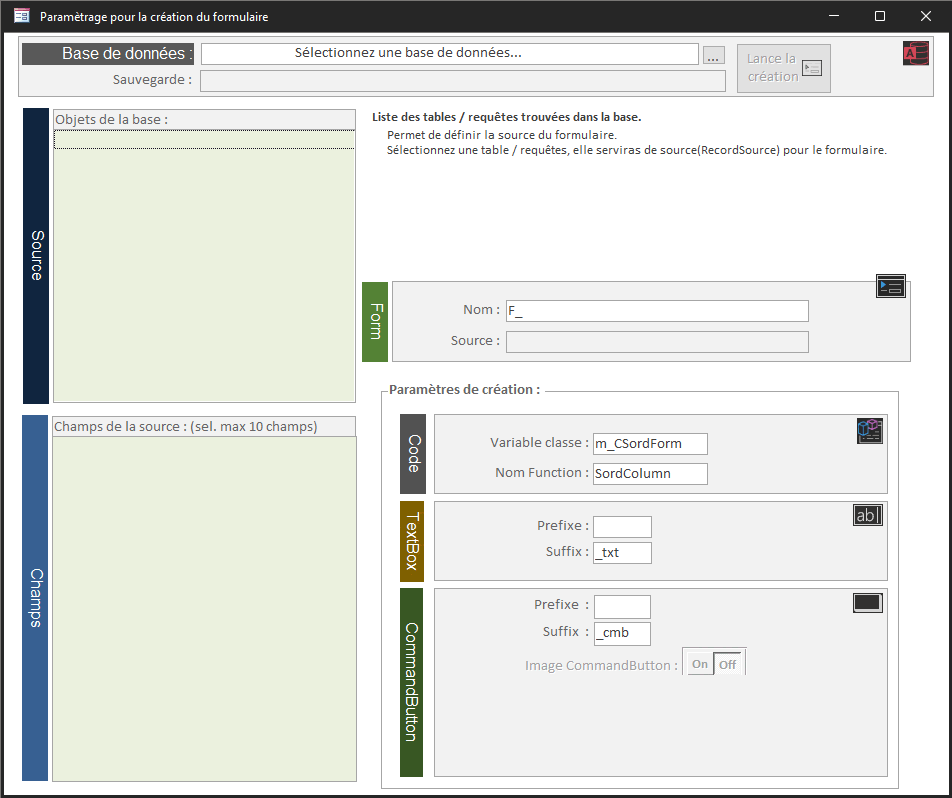
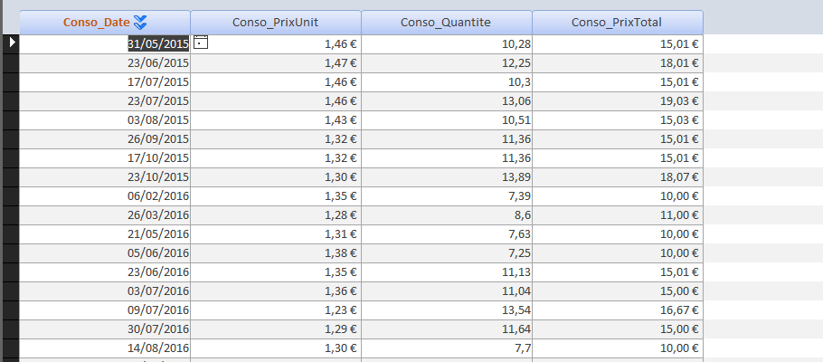
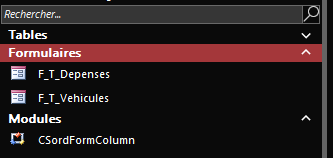
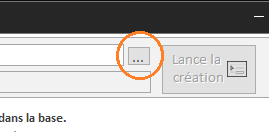
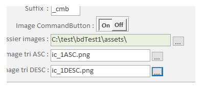
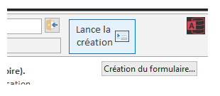

# Création automatique d'un formulaire en continu avec tri sur les colonnes

## Formulaire de création

## Création du formulaire

## Formulaire créer

## Objets insérés

- Le formulaire crée.
- Le module de classe `CSordFormColumn`.

## Description

Cet outil permet de créer automatiquement des formulaires en continu avec un bouton de tri sur les colonnes.

### Le formulaire `F_CreateForm`

> - Permets de sélectionner la base source.
> - De choisir la source du formulaire et de définir son nom.
> - - Note : Seule les requêtes sélection sont affichées dans la liste, les requêtes ajout, MàJ., suppression, création sont ignorées.
> - De choisir les champs à utiliser.
> - - Note : Les champs contenant un/des espaces dans leur nom sont ignorés.
> - De définir le nom de la variable de la classe et de la fonction de tri.
> - De définir un préfixe et/ou suffixe pour le nom des CommandButton et les TextBox.
> - De choisir (ou non) le dossier et les images utilisées pour les CommandButton.

- Une fois ces choix fait, cliquer sur le bouton 'Lancer la création'
- <mark>La base source est sauvegardée avant toute modification</mark>.

### La création se déroule en plusieurs étapes

> - Création de la classe `CSordFormColumn`.
> - Création du formulaire.
> - Création des TextBox et CommandButton dans le formulaire.
> - Insertion du code pour les CommandButton
> - Insertion de la fonction qui utilise la classe `CSordFormColumn`.

## Utilisation

- Ouvrir le formulaire `F_CreateForm`, sélectionnez la base source
  
    

- Sélectionnez une source (table/requête) pour le formulaire.
- Sélectionnez les champs à inclure (max 10).
- Modifiez les paramètres ou utilisez ceux par défaut (Nom, préfixe, etc..).
- Vous pouvez définir des images pour les CommandButton.

    

  - Pour cela, indiquez le dossier des images et les images à utiliser.
  - une pour le tri ASC et une pour le tri DESC (idéalement utilisez des images en 16x16 pixel).
- Une fois les options défnies, lancer la création avec le bouton.

    
- Un résumé des opérations s'ouvre, confirmez ou annulez
- NOTE : la base source est sauvegardée avant toutes modifications.

## Résumé

|   Créer le|   2022/04/05|
| - | - |
|   Auteur| [@meuslau](https://github.com/meuslaur)|
|   Catégorie|   MsAccess|
|   Type|   Utilitaire|
|   Langage|   VBA|

## Outils :

### Code exporté avec l'outil de : [@joyfullservice](https://github.com/joyfullservice) - [msaccess-vcs-integration](https://github.com/joyfullservice/msaccess-vcs-integration)

- Créez une base vide et utilisez `msaccess-vcs-integration` pour réimporter le code.
