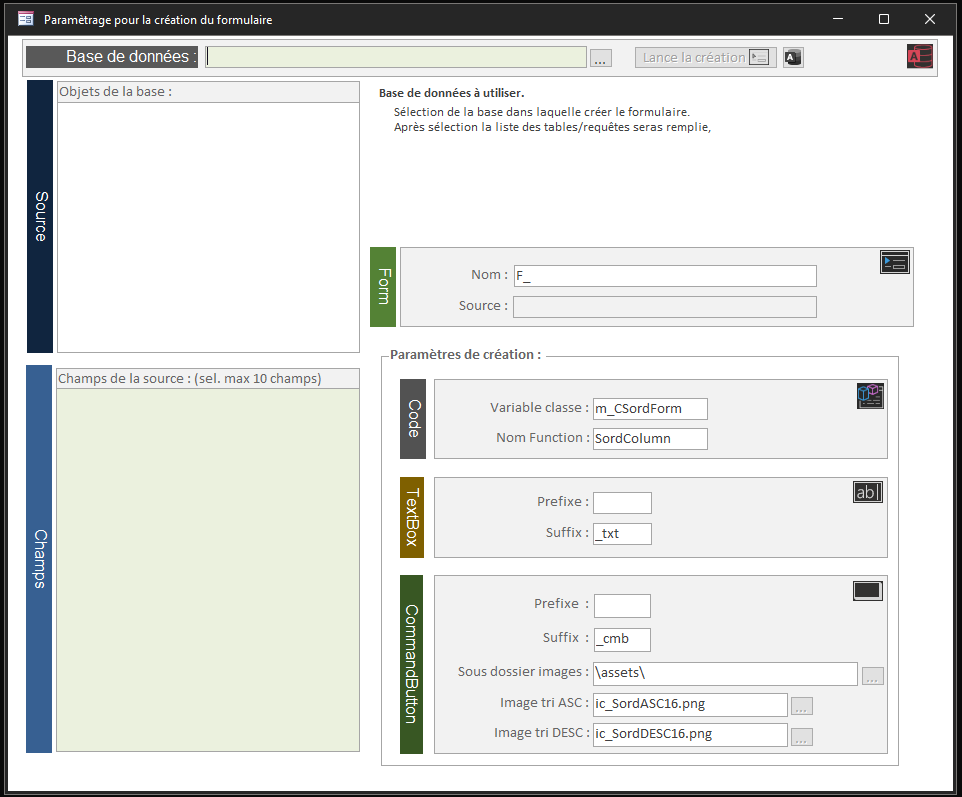
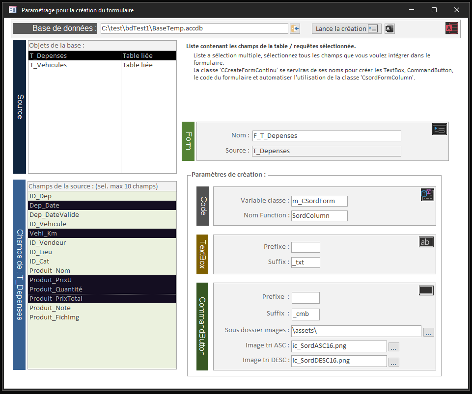
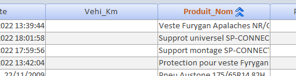

# Création automatique d'un formulaire en continu

## Création du formulaire

### Insertion Function pour les CommandButton

## Création des CommandButton et des TextBox

### Code sur les CommandButton pour le tri des colonnes

## Insertion des TextBox dans la section Detail

## Insertion de la Classe pour le tri sur les colonnes

**_Code exporter avec l'outil :_**

[@joyfullservice](https://github.com/joyfullservice)

[msaccess-vcs-integration](https://github.com/joyfullservice/msaccess-vcs-integration)

<!---
meuslaur/meuslaur is a ✨ special ✨ repository because its `README.md` (this file) appears on your GitHub profile.
You can click the Preview link to take a look at your changes.
--->
